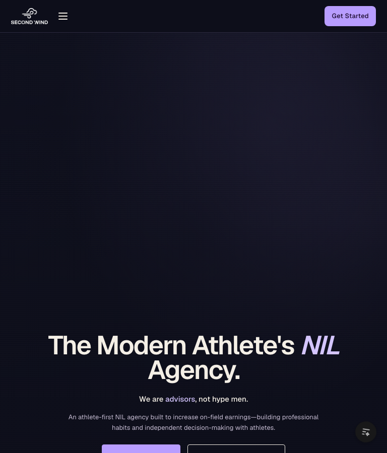

# Responsiveness Check: http://localhost:8001/

**Date**: 2026-06-08  
**Mode**: Standard  
**Breakpoints tested**: 320, 375, 768, 1024, 1280, 1440, 1920, 2560 (height 900px)  
**Browser tool**: Playwright (headless Chromium via `scripts/responsive-audit.mjs`)

## Summary

| Width | Status | Issues |
|-------|--------|--------|
| 320px | Warn | Touch targets below 44px |
| 375px | Warn | Touch targets below 44px |
| 768px | Warn | Hero primary CTA clipped at bottom; touch targets (N/A check) |
| 1024px | Pass | — |
| 1280px | Pass | — |
| 1440px | Pass | — |
| 1920px | Warn | Intentional max-width gutters on ultra-wide |
| 2560px | Warn | Same ultra-wide gutters |

**Overall**: 0 critical/high layout breaks. 4 breakpoints have polish issues — mostly sub-44px touch targets on phones and hero CTA clipping at tablet portrait. No horizontal overflow detected at any width.

Screenshots: `docs/responsiveness-screenshots/` (320 hero, 768 hero/transfer, 375 modal, 1024 desktop, 2560 ultra-wide).

---

## Critical & High Issues

None. Horizontal overflow is **0px** at all eight breakpoints. Navigation mode switches cleanly. Transfer wire rows, roster carousel, services accordion, and athlete modal all fit within the viewport.

---

## Medium Issues

### Hero primary CTA clipped at tablet portrait — Medium

**Width(s)**: 768px  
**Check**: CTA visibility

At 768×900, the hero fills the full viewport height (`min-height: 100svh` / 900px) with content anchored to the bottom (`justify-content: flex-end`). The primary “View Roster” button sits at `top: 883px` / `bottom: 933px`, so roughly **33px of the button is below the fold** without scrolling.



**Fix suggestion**: At the `max-width: 980px` breakpoint, reduce hero `min-height` (e.g. `min(100svh, 820px)`), switch to `justify-content: center` earlier (below 768px), or add bottom safe-area padding so CTAs clear the fold on common tablet heights.

---

### Touch targets under 44×44px on mobile — Medium

**Width(s)**: 320px, 375px  
**Check**: Touch targets

Automated scan found **32** undersized interactive elements at 320px and **58** at 375px (excluding dev tooling). Recurring offenders:

| Element | Size (approx.) | Notes |
|---------|----------------|-------|
| `.nav-toggle` | 40×40px | Hamburger — 4px short |
| `.nav-cta` | 92×35px | Header CTA |
| `.nav-brand` | 64×28px | Logo link |
| `.tab` (roster filters) | 72–113×33px | Horizontally scrollable — height short |
| `.partner-btn` | full-width × 31px | Roster card actions |
| `.svc-stack-tab` | full-width × 36px | Accordion tabs — height short |
| `.skip-link` | 171×43px | Focus-only — 1px short on height |

These are usable but fall below the 44px WCAG 2.5.5 / Apple HIG recommendation for mobile.

**Fix suggestion**: Bump vertical padding on `.nav-toggle`, `.nav-cta`, `.tab`, `.partner-btn`, and `.svc-stack-tab` inside `@media (max-width: 980px)` so hit areas reach ≥44px without changing visual density drastically (e.g. `min-height: 44px` + flex centering).

---

## Low Issues

### Decorative 10–11px type in marketing illustrations — Low

**Width(s)**: All  
**Check**: Text overflow / readability

Eyebrows (`.eyebrow`, `.num`) at 11px and in-panel chrome (`.mkt-chrome-count` at 10px) are intentional mono labels inside service illustrations. They do not cause layout overflow; readability is acceptable for supplementary UI chrome, not body copy.

### Ultra-wide empty gutters — Low

**Width(s)**: 1920px, 2560px  
**Check**: Whitespace balance

Content width caps at **1400px** (`--container`), leaving ~260px margins at 1920px and ~580px at 2560px. This matches the design system and keeps line lengths readable; ultra-wide displays feel spacious rather than broken.


---

## Transition Analysis

| Transition | Observed At | Clean? | Notes |
|-----------|-------------|--------|-------|
| Nav: hamburger → full links | **981px** | Yes | `.nav-links` hidden ≤980px; toggle shown. No in-between broken state at 979 vs 981. |
| Agency: 2-col → 1-col | **≤980px** | Yes | `grid-template-columns: 1fr` in stack breakpoint |
| Services: scroll stack → mobile accordion | **≤980px** | Yes | Stack height drops from ~5400px (desktop pin-scroll) to ~666–866px (auto accordion) |
| Transfer wire: table row → stacked card grid | **≤980px** | Yes | No row overflow at 320px when scrolled into view |
| Section heads: row → column | **≤560px** | Yes | `.section-head { flex-direction: column }` |
| Hero CTA: row → column stack | **≤560px** | Yes | Full-width stacked buttons on small phones |
| Roster cards: fixed 300px → fluid `min(280px, …)` | **≤980px** | Yes | Cards scale to 244–280px on narrow viewports |

CSS breakpoints in use: **1200px** (tablet gutter/type), **980px** (stack/nav drawer), **560px** (small phone).

---

## Per-Breakpoint Notes

### 320px — Warn

- No horizontal overflow; transfer wire rows fit (max right edge 298px).
- Section head in `#transfer` stacks vertically as intended.
- Primary hero CTA visible above the fold.
- 32 interactive elements below 44px minimum dimension.

### 375px — Warn

- Athlete modal opens correctly (343×538px, no overflow).
- Same touch-target pattern as 320px.

### 768px — Warn

- Hero primary CTA partially below fold (see Medium issue).
- Hamburger nav still active (correct — breakpoint is 980px).
- Services accordion and roster carousel layout correctly.

### 1024px+ — Pass

- Full horizontal nav, desktop services scroll-stack, two-column agency layout.
- Content scales up to 1400px container cap.

---

## Recommendations

### Quick fixes (CSS only)

1. **Hero CTA at 768px** — Reduce mobile hero min-height or center content below 900px viewport heights so CTAs stay fully visible.
2. **Touch targets** — Add `min-height: 44px` (and min-width where needed) to nav toggle, header CTA, roster tabs, partner buttons, and service accordion tabs on `max-width: 980px`.
3. **Roster filter tabs** — Already horizontally scrollable; increasing tab height to 44px is low-risk.

### Structural changes

None required for responsiveness. Layout architecture (980px stack breakpoint, 560px phone tier, 1400px container) is coherent and transitions are sharp.

### Re-run audit

```bash
cd second-wind-playground
node scripts/responsive-audit.mjs
```
